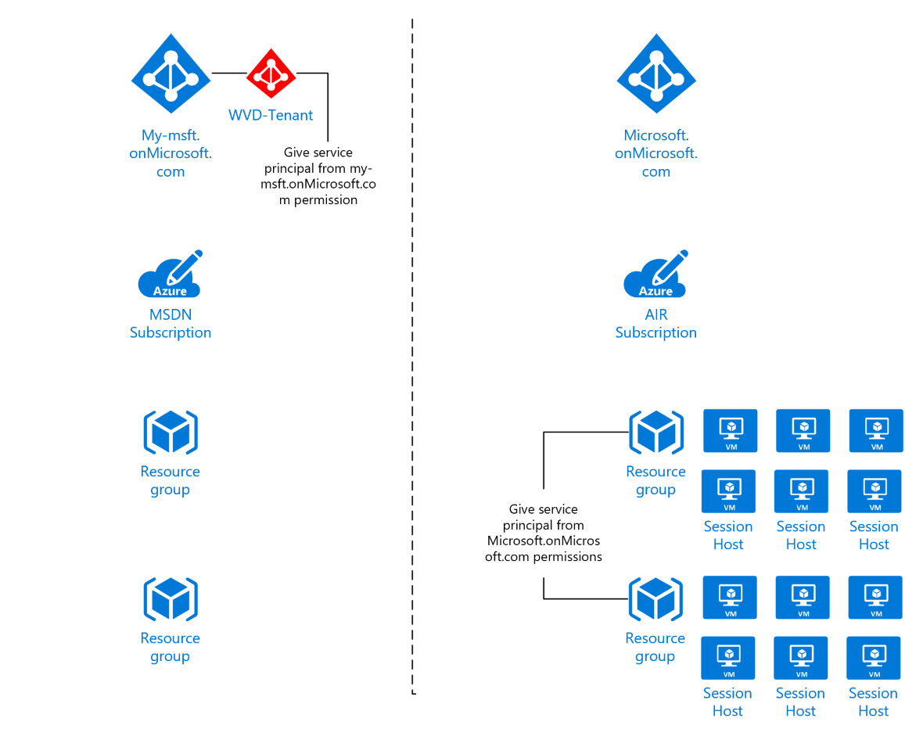
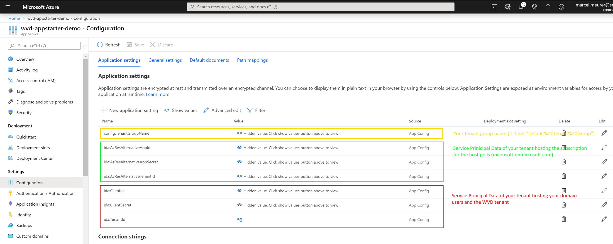

# Using Azure Starter for Windows Virtual Desktop in 2-AAD-Environment (Microsoft Demo Case)

Usually, the WVD tenant and the resources (sessions hosts) are in the same AAD tenant. If you have two Azure AD tenant, you can use Azure Starter for WVD with a second service principal to access the session hosts.

Example:

- **Azure AD 1 - "*my-msft.onMicrosoft.com*"**
  - Your personal AAD where you have your users, an AD-Controller, AD-Connect (or AD domain services), and other resources. In this AAD you have deployed your WVD tenant.
  - 
- **Azure AD 2 - "*microsoft.onMicrosoft.com*"**
  - You have no high-level permission to the AAD because it's own by your company and shared with many other users/professionals. In this AAD, you have a subscription (AIR) containing your session hosts. 

Create the **first service principal** in "my-msft.onMicrosoft.com". Configure this service principal as described in the primary guide - except permitting to the resource group containing the session hosts (these are in the other tenant). In the web app use ida:ClientId, ida:ClientSecret and ida:TenantId to for the data of the service principal.

Create the **second service principal** in "microsoft.onMicrosoft.com". Give the service principal "Virtual Machine Contributor" permission to the resource group containing the session hosts. Go to the web app configuration and use the following variables to configure the service principal for the session hosts:

- ida:AzResAlternativeTenantId
- ida:AzResAlternativeAppId
- ida:AzResAlternativeAppSecret

If you use another tenant group name as "Default Tenant Group" add another variable and set your tenant group name:

- config:TenantGroupName

Restart the web app to work with Azure Starter for WVD

Read more on [Readme.md](../readme.md)